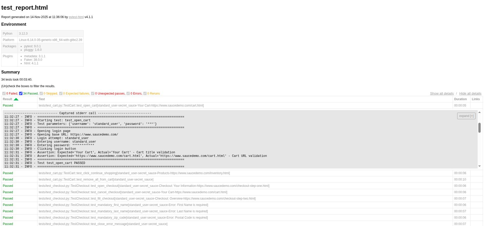

## SauceDemo UI Tests with Selenium

UI test suite for [SauceDemo](https://www.saucedemo.com) - a sample e-commerce website by SauceLabs for practicing test automation.

**Current version**: `0.1.0`  
See `RELEASE.md` for detailed release notes.

## Quick Start

```bash
# Install dependencies
make install

# Run tests in headless mode
make test

# Run tests in UI mode (visible browser)
make test-ui

# Run tests with HTML report
make test-html
```

## Tech Stack

**Core packages:**
- `pytest` - testing framework
- `selenium` - browser automation
- `webdriver-manager` - automatic ChromeDriver management
- `faker` - test data generation
- `pytest-html` - HTML reports with logs
- `python-dotenv` - environment configuration
- `uv` - Python package manager

**Development tools:**
- `ruff` - linter and formatter (replaces flake8 + black + isort)

## Project Structure

### Page Objects (`pages/`)
Page Object Model implementation - each page has its own class:
- `base_page.py` - base class with common Selenium methods
- `login_page.py` - login page interactions
- `inventory_page.py` - product catalog page
- `product_page.py` - individual product details
- `cart_page.py` - shopping cart
- `checkout_page.py` - checkout form
- `overview_page.py` - order overview
- `order_page.py` - order confirmation

### Utils Modules (`utils/`)
- `logger.py` - custom logger for test execution (saves to files + outputs to HTML report)
- `generator.py` - test data generation via Faker

### Test Data (`data/`)
- `tests_data.py` - test credentials, URLs, and expected messages

### Locators (`locators/`)
- `page_locators.py` - Selenium locators for page elements

### Tests (`tests/`)
- `conftest.py` - pytest fixtures (WebDriver setup, page objects, logging)
- `test_base.py` - base test class (`BaseTest`) that all test classes inherit from
- `test_*.py` - test suites for each module

## Implementation Details

### Fixture-based Test Infrastructure
Uses pytest fixtures for test environment setup:
- `driver` - Chrome WebDriver with optimized settings
- `pages` - page objects accessible across tests
- `data` - Faker-based data generator
- `log_test_execution` - automatic test logging

### Base Test Class
All test classes inherit from `BaseTest` (in `test_base.py`), which automatically injects `pages` and `data` fixtures into test instances via the `injector` fixture.

### Page Object Model (POM)
Clean separation of test logic from page interactions:
- Locators stored separately in `locators/page_locators.py`
- Reusable actions in base page class
- Business logic methods in specific page classes

### Dual Logging
- **File logging**: detailed test execution logs in `logs/test_run_*.log` with test separators
- **HTML reports**: test logs displayed in pytest-html reports
- **Console output**: real-time test execution info

### Browser Configuration
Chrome WebDriver configured with:
- Disabled password manager and leak detection popups
- Disabled automation detection
- Support for headless and UI modes
- Optimized for CI/CD and Docker environments

## Linting and Formatting

Project uses **Ruff** - a fast Rust-based linter that replaces flake8, black, isort and other tools.

```bash
# Check code
make lint

# Auto-fix issues
make fix

# Format code
make format

# Check formatting
make format-check
```

Ruff is configured with rules:
- pycodestyle (E, W)
- pyflakes (F)
- isort (I)
- pep8-naming (N)
- pyupgrade (UP)
- flake8-bugbear (B)
- flake8-comprehensions (C4)
- flake8-simplify (SIM)

## Docker

Project is containerized for consistent test execution:

```bash
# Build image
make docker-build

# Run tests in Docker (headless)
make docker-test

# Run tests in Docker with HTML report
make docker-test-html

# Open shell in container
make docker-shell

# Clean up Docker resources
make docker-clean
```

Dockerfile uses Python 3.11 slim image and Chrome for stable test execution.

## Reports and Logs

**HTML Reports** (`reports/test_report.html`):
- Test execution summary
- Detailed logs for each test
- Pass/fail status and duration
- Environment metadata

**File Logs** (`logs/test_run_*.log`):
- Complete test execution logs
- Timestamps for each action
- Test separators for easy navigation
- DEBUG level details for troubleshooting

## Test Execution Examples

### HTML Report Example

Generated HTML report (`reports/test_report.html`) provides a comprehensive view of test execution:



The report includes:
- Test execution summary with pass/fail statistics
- Environment details (Python version, platform, packages)
- Detailed logs for each test with timestamps
- Expandable test details for troubleshooting

### Log File Example

Each test execution is logged with detailed step-by-step information in `logs/test_run_*.log`:

```
================================================================================
Starting test: test_open_cart
Test parameters: {'username': 'standard_user', 'password': '***'}
================================================================================
2025-11-14 11:32:27 - LoginPage - INFO - Opening login page
2025-11-14 11:32:27 - LoginPage - INFO - Opening base URL: https://www.saucedemo.com/
2025-11-14 11:32:30 - LoginPage - INFO - Login attempt: standard_user
2025-11-14 11:32:30 - LoginPage - INFO - Entering username: standard_user
2025-11-14 11:32:30 - LoginPage - INFO - Entering password: ************
2025-11-14 11:32:30 - LoginPage - INFO - Clicking login button
2025-11-14 11:32:31 - tests.test_cart - INFO - Assertion: Expected='Your Cart', Actual='Your Cart' - Cart title validation
2025-11-14 11:32:31 - tests.test_cart - INFO - Assertion: Expected='https://www.saucedemo.com/cart.html', Actual='https://www.saucedemo.com/cart.html' - Cart URL validation
================================================================================
Test test_open_cart PASSED
================================================================================
```

Each log entry includes:
- Timestamp for precise tracking
- Component name (e.g., LoginPage, CartPage)
- Log level (INFO, DEBUG, WARNING, ERROR)
- Action description with relevant parameters
- Assertion validations with expected vs actual values
- Test result status (PASSED/FAILED)

## Configuration

Configuration via environment variables in `.env`:
- `HEADLESS` - browser mode (`headless` or `ui`)
- `CHROMEDRIVER_PATH` - path to ChromeDriver (optional)

## Test Coverage

- **Login**: 7 tests (valid/invalid credentials, locked user, logout, error handling)
- **Inventory**: 7 tests (sorting, filtering, product selection)
- **Product**: 2 tests (navigation, add to cart)
- **Cart**: 3 tests (add/remove items, continue shopping)
- **Checkout**: 4 tests (form validation, cancel, complete flow)
- **Overview**: 3 tests (order review, cancel, finish)
- **Order**: 2 tests (confirmation page, back to products)

Total: **28+ tests** covering main e-commerce scenarios.

## Available Commands

### Setup
```bash
make install       # Install dependencies with uv (including dev tools)
```

### Testing
```bash
make test          # Run test suite (headless)
make test-ui       # Run tests in UI mode (visible browser)
make test-headless # Run tests in headless mode
make test-html     # Run tests and generate HTML report
make all           # Install, format, lint, and test (full workflow)
```

### Code Quality
```bash
make lint          # Run Ruff lint checks
make format        # Format code with Ruff
make format-check  # Check formatting without modifying files
make fix           # Auto-fix lint issues and format code
```

### Docker
```bash
make docker-build       # Build Docker image
make docker-test        # Run tests in Docker (headless)
make docker-test-html   # Run tests in Docker with HTML report
make docker-shell       # Open shell in Docker container
make docker-clean       # Remove Docker containers and images
```

### Maintenance
```bash
make clean         # Remove cache artifacts, reports, and logs
make help          # Show all available commands
```

---

**Website Under Test**: https://www.saucedemo.com


